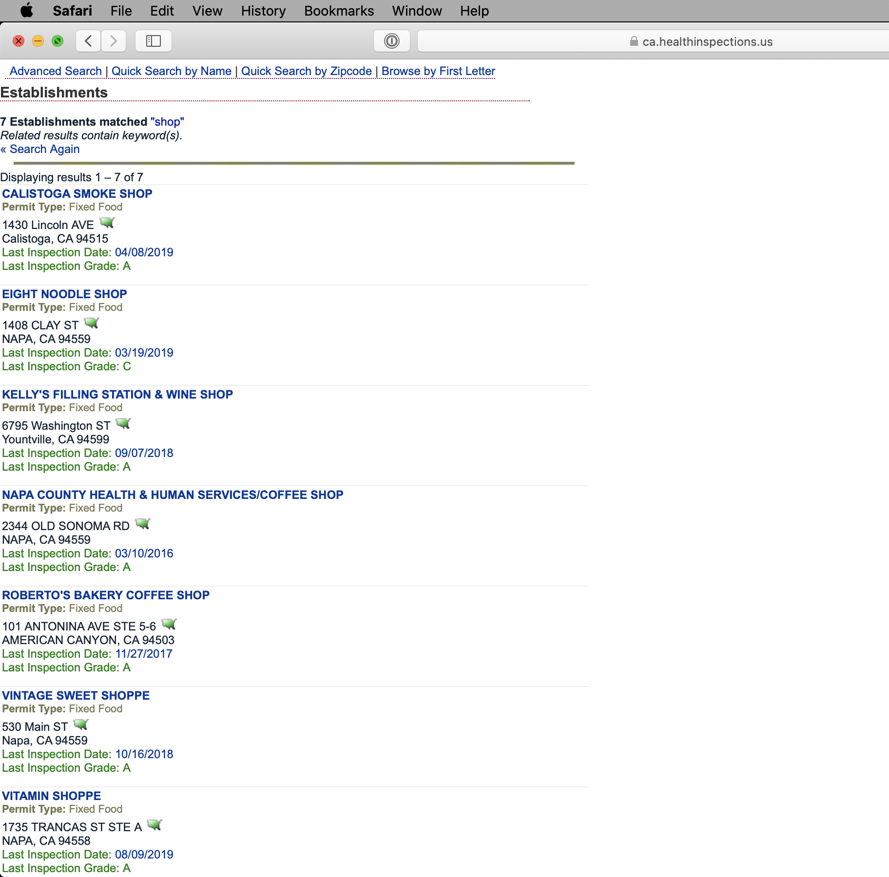
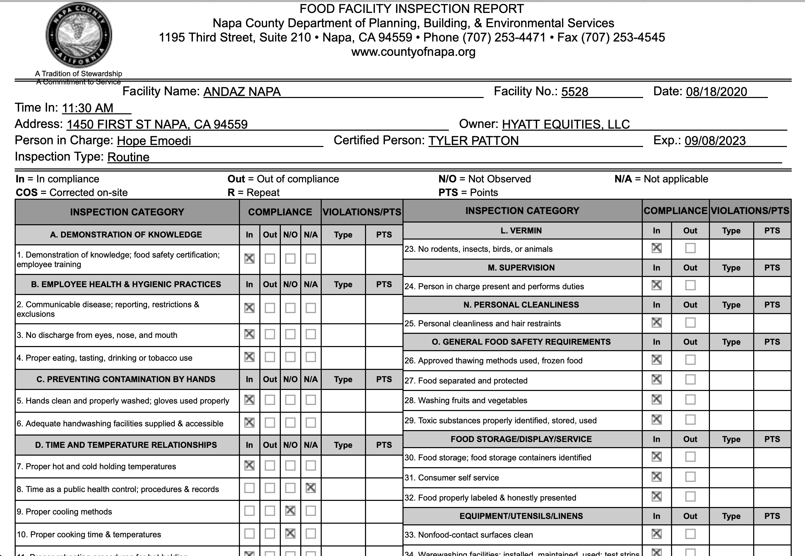

# Food Inspections Parser
This project is a parser that scrapes inspection reports from the Napa Valley [health department website](https://ca.healthinspections.us/napa/)
 and then prints the collected information from reports to the console in a tabular format as well as generating a json file with the data.

This website has a list of establishments and for each establishment a list of inspections that have been performed. For each inspection, there is a full report with details of the outcome.

Here is a sample search result for keyword: shop



<br/><br/>

This is an example of the [report](https://ca.healthinspections.us/_templates/135/Food%20Inspection/_report_full.cfm?domainID=135&inspectionID=921499&dsn=dhd_135):


This project uses [BeautifulSoup](https://www.crummy.com/software/BeautifulSoup/bs4/doc/) library to read information from the inspection reports for establishments.
It loads all establishments, then parses information for each establishment, and finally parses inspection reports for each establishment.

Here is an example of the output:
```
Permit ID: 11367
Name: 1313 MAIN STREET
Address: 1313  MAIN  ST
City: NAPA
State: CA
Zip code: 94559
Inspections:
	Inspection ID: 409588
	Inspection Type: Routine
	Grade: A
	Date: 11/02/2016
	Violations:
		Number: 35
		Description: Equipment/Utensils - approved; installed; clean; good repair; capacity
		Number: 44
		Description: Premises; personal/cleaning items; vermin-proofing
		Number: 48
		Description: Plan Review

	Inspection ID: 313513
	Inspection Type: Routine
	Grade: A
	Date: 01/13/2016
	Violations:
		Number: 30
		Description: Food storage; food storage containers identified

	Inspection ID: 221606
	Inspection Type: Routine
	Grade: A
	Date: 05/05/2015
	Violations:
		Number: 6
		Description: Adequate handwashing facilities supplied & accessible
		Number: 44
		Description: Premises; personal/cleaning items; vermin-proofing

	Inspection ID: 221340
	Inspection Type: Routine
	Grade: A
	Date: 10/22/2014
	Violations:
		Number: 48
		Description: Plan Review

	Inspection ID: 221091
	Inspection Type: Routine
	Grade: A
	Date: 04/15/2014
	Violations:
		Number: 35
		Description: Equipment/Utensils - approved; installed; clean; good repair; capacity

	Inspection ID: 150968
	Inspection Type: Routine
	Grade: A
	Date: 09/24/2013
	Violations:
		Number: 18
		Description: Compliance with variance, specialized process, & HACCP Plan

	Inspection ID: 108409
	Inspection Type: Routine
	Grade: A
	Date: 12/06/2012
	Violations:

	Inspection ID: 107912
	Inspection Type: Routine
	Grade: A
	Date: 03/07/2012
	Violations:
		Number: 36
		Description: Equipment, utensils and linens: storage and use

	Inspection ID: 107199
	Inspection Type: Routine
	Grade: A
	Date: 02/23/2011
	Violations:


Permit ID: 249940
Name: 641 MAIN STREET
Address: 641  MAIN  ST
City: SAINT HELENA
State: CA
Zip code: 94574
Inspections:
	Inspection ID: 628555
	Inspection Type: Routine
	Grade: A
	Date: 02/01/2018
	Violations:

	Inspection ID: 439495
	Inspection Type: Routine
	Grade: A
	Date: 11/22/2016
	Violations:
		Number: 6
		Description: Adequate handwashing facilities supplied & accessible
		Number: 35
		Description: Equipment/Utensils - approved; installed; clean; good repair; capacity

	Inspection ID: 266543
	Inspection Type: Routine
	Grade: A
	Date: 11/10/2015
	Violations:
		Number: 23
		Description: No rodents, insects, birds, or animals
		Number: 29
		Description: Toxic substances properly identified, stored, used
		Number: 34
		Description: Warewashing facilities: installed, maintained, used; test strips

	Inspection ID: 209267
	Inspection Type: Routine
	Grade: A
	Date: 03/03/2015
	Violations:
		Number: 36
		Description: Equipment, utensils and linens: storage and use

	Inspection ID: 209147
	Inspection Type: Routine
	Grade: A
	Date: 09/04/2014
	Violations:
		Number: 1
		Description: Demonstration of knowledge; food safety certification; employee training
```

